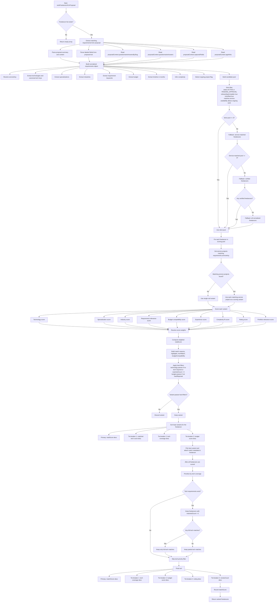
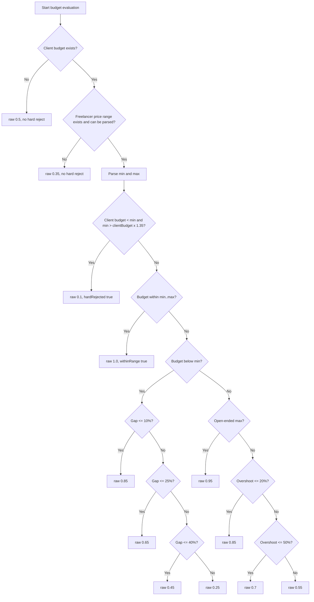

# Freelancer Matching Flow

This document describes how freelancer matching currently works in `src/shared/lib/freelancer-matching.js`.

Primary entry point:

- `rankFreelancersForProposal(freelancers, proposal)`

Supporting stages:

- `extractMatchingRequirements(proposal)`
- `buildCandidatePool(freelancers, requirements)`
- `computeScoreForProject(freelancer, serviceProject, requirements)`
- `prioritizeByTechCoverage(scoredFreelancers, requirements)`

## End-to-End Flow

## Requirement Extraction Details

`extractMatchingRequirements(proposal)` pulls data from five places and merges them:

1. `proposal.summary` and `proposal.content`
2. Labeled fields parsed from proposal text
3. `proposal.proposalContext.questionnaireAnswersBySlug`
4. `proposal.proposalContext.questionnaireAnswers`
5. `proposal.proposalContext.capturedFields`

Extra app-specific hints can also contribute through `proposal.proposalContext.appHints`.

The output contains:

- `serviceKey`
- `technologies`
- `technologyCanonicals`
- `specializations`
- `industries`
- `requirementKeywords`
- `budget`
- `timelineMonths`
- `complexity`
- `isOngoingProject`

### Complexity Inference

If an explicit complexity hint exists, it wins.

Otherwise complexity is inferred with a score:

- Budget `>= 300000`: `+2`
- Budget `>= 100000`: `+1`
- Timeline `>= 6 months`: `+2`
- Timeline `>= 3 months`: `+1`
- Feature count `>= 10`: `+2`
- Feature count `>= 6`: `+1`

Final complexity:

- Score `>= 4` => `large`
- Score `>= 2` => `medium`
- Else => `small`

## Candidate Pool Fallback Order

The matcher does not always score every freelancer immediately. It first tries to narrow the pool:

1. Strict candidates
   - Allowed status: `ACTIVE` or `PENDING_APPROVAL`
   - `onboardingComplete === true`
   - `isVerified === true`
   - Matches the requested service
   - If the project is ongoing, at least one matching service project must allow in-progress work
2. If strict candidates are fewer than `3`, use service-matched freelancers
3. If still fewer than `3`, use verified freelancers
4. If none exist, fall back to the normalized freelancer list

## Score Weights

Base weights:

| Dimension | Weight |
| --- | ---: |
| Technology | 30 |
| Specialization | 22 |
| Industry | 13 |
| Requirement relevance | 12 |
| Budget | 13 |
| Experience | 5 |
| Complexity | 2 |
| Rating | 2 |
| Portfolio | 1 |

If no technology requirements are extracted:

- Technology weight becomes `0`
- `40%` of that weight moves to specialization
- `30%` moves to industry
- `30%` moves to requirement relevance

## Budget Compatibility Decision Tree

Important hard rejection:

- A freelancer is budget-hard-rejected only when:
  - `clientBudget < minPrice`
  - and `minPrice > clientBudget * 1.35`

## Dimension-Level Scoring Summary

- Technology
  - Uses canonical tech aliases plus fuzzy tech matching
  - Full match is possible only when all required technologies are covered
- Specialization
  - Compares required specializations against service specializations
- Industry
  - Compares required industries against service and profile industry focus
- Requirement relevance
  - Tokenizes proposal keywords, removes stop words, then compares against freelancer skills, services, profile details, service details, project text, and portfolio text
- Budget
  - Uses client budget vs freelancer price range
- Experience
  - Maps years or declared experience band to a normalized rank
- Complexity
  - Checks whether freelancer service complexity fits the inferred project complexity
- Rating
  - Uses freelancer rating and review count
- Portfolio
  - Looks for overlap in tech, specialization, budget presence, and project links

## Hard Filters

A scored variant is discarded if either of these fails:

- Technology hard filter
  - If technology requirements exist, the freelancer must match at least one required technology
- Budget hard filter
  - The freelancer cannot be more than `35%` above the client budget floor

## Variant Selection Per Freelancer

A freelancer can have multiple matching service projects. Each project is scored as its own variant.

Variant comparison order:

1. `totalScore`
2. `techMatch.matchedCount`
3. `techMatch.coverage`
4. `budgetCompatibility.score`

Only the best variant survives and is attached back to the freelancer record.

## Final Ranking Order

After variant selection and tech-priority filtering, final freelancers are sorted by:

1. `matchScore`
2. `techMatch.coverage`
3. `budgetCompatibility.score`
4. `rating`
5. `reviewCount`

## Returned Matching Metadata

Each returned freelancer is enriched with:

- `matchScore`
- `matchBreakdown`
- `matchedTechnologies`
- `matchReasons`
- `matchHighlights`
- `techMatch`
- `budgetCompatibility`
- `matchedService`
- `matchHardFilters`

## Practical Summary

The matcher is a weighted scoring engine with two strong gating behaviors:

- Candidate pool narrowing before scoring
- Hard filtering after scoring for technology and severe budget mismatch

So in practice, a freelancer usually reaches the top only if they:

- match the requested service
- are verified and onboarding-ready
- cover at least part of the required tech stack
- are not materially outside the client budget
- show relevant specialization, industry, and portfolio evidence
