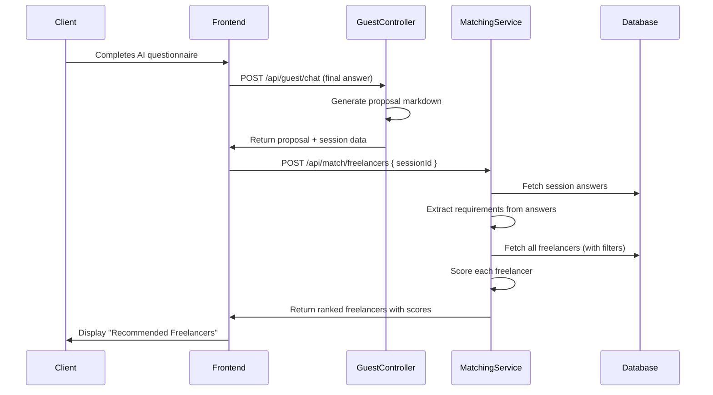

# Freelancer-Proposal Matching Algorithm — Design Document

## 1. Goal

After a client completes the AI questionnaire at `/ai-demo` and a proposal is generated, the system must **automatically find and rank the best freelancers** for that project. The matching must work across all service types (web dev, app dev, branding, SEO, creative design, lead gen, AI automation, etc.).

---

## 2. Data We Already Have

### 2.1 Proposal / Client Requirements (from AI Questionnaire)

The proposal context object (`proposalContext`) already captures these fields at proposal-generation time:

| Field | Source | Example |
|---|---|---|
| `serviceName` | Selected service card | `"Web Development"`, `"App Development"` |
| `serviceId` (slug) | Service record | `"web_development"`, `"app_development"` |
| `questionnaireAnswersBySlug` | All answered questions by slug | `{ "tech_stack": "React / Next.js", "budget": "60000", ... }` |
| `questionnaireAnswers` | Same but keyed by question text | `{ "Which tech stack?": "React / Next.js" }` |
| `capturedFields` | Array of `{ question, answer }` | Confirmed user inputs |
| `appHints` (app dev only) | `buildAppProposalHints()` | `{ mobileTechnology: "Flutter", backendTechnology: "Node.js", ... }` |

From the generated proposal markdown we can also parse:
- **Service Type** — `Web Development`, `App Development`, `Branding`, etc.
- **Tech Stack** — Frontend framework, backend, database, hosting
- **Platform** — iOS, Android, cross-platform
- **Budget** — e.g. `₹60,000`, `₹2,50,000`
- **Timeline** — `3 months`, `6 months`
- **Industry / Niche** — from project description
- **Features / Deliverables** — list of required features
- **Project Complexity** — implied by feature count, budget, timeline

### 2.2 Freelancer Data (from `User` + `FreelancerProject`)

Each freelancer has a rich profile stored across two models:

#### `User` model fields
| Field | Type | Use for Matching |
|---|---|---|
| `services` | `String[]` | Primary filter — `["web_development", "lead_generation"]` |
| `skills` | `String[]` | Tech skills — `["React Next.js", "Node.js", "Shopify"]` |
| `location` | `String?` | Location-based preference |
| `experienceYears` | `Int` | Seniority filter |
| `rating` | `Decimal` | Quality ranking boost |
| `reviewCount` | `Int` | Social proof boost |
| `profileDetails` | `Json` | Deep profile with `serviceDetails`, `availability`, `globalIndustryFocus` |
| `hourlyRate` | `Decimal?` | Budget compatibility |

#### `FreelancerProject` model fields (each freelancer can have multiple)
| Field | Type | Use for Matching |
|---|---|---|
| `serviceKey` | `String` | Service type — `"web_development"`, `"ai_automation"` |
| `activeTechnologies` | `String[]` | **Key matching field** — `["React / Next.js", "Node.js", "Tailwind CSS"]` |
| `serviceSpecializations` | `String[]` | **Key matching field** — `["E-commerce", "SaaS Platforms", "Landing Pages"]` |
| `industriesOrNiches` | `String[]` | Industry match — `["Technology", "E-commerce", "SaaS"]` |
| `projectComplexityLevel` | `String` | `"small"`, `"medium"`, `"large"` |
| `averageProjectPriceRange` | `String` | Budget range — `"INR 1 Lakh - 3 Lakhs"` |
| `yearsOfExperienceInService` | `String` | `"less_than_1"`, `"1_3"`, `"3_5"`, `"5_plus"` |
| `acceptInProgressProjects` | `String` | `"yes"` / `"no"` |
| `tags` | `String[]` | Project-level tech tags |
| `techStack` | `String[]` | Project-level stack |
| `budget` | `Int` | Past project budget (shows capability) |

---

## 3. Matching Algorithm — Multi-Layer Scoring

The matching works as a **weighted scoring system** where each freelancer is scored against the proposal requirements. We compute a score from 0–100 for each freelancer and return them ranked.

### 3.1 Architecture Overview

```
┌──────────────────────┐
│   Client Proposal    │
│  (from AI Session)   │
└─────────┬────────────┘
          │
          ▼
┌──────────────────────┐
│  Extract Requirements│  ← Parse proposal into structured matching criteria
│  (Normalize + Token) │
└─────────┬────────────┘
          │
          ▼
┌──────────────────────┐
│  Stage 1: Filter     │  ← Hard filters (service type, availability, status)
│  (Eliminate non-fits)│
└─────────┬────────────┘
          │
          ▼
┌──────────────────────┐
│  Stage 2: Score      │  ← Weighted multi-dimension scoring
│  (Rank candidates)   │
└─────────┬────────────┘
          │
          ▼
┌──────────────────────┐
│  Stage 3: Rank       │  ← Sort, apply boosts, return top N
│  (Final ordering)    │
└──────────────────────┘
```

---

### 3.2 Stage 1 — Hard Filters (Eliminate Non-Fits)

Before scoring, eliminate freelancers who simply cannot fulfill the project:

| Filter | Logic | Source |
|---|---|---|
| **Service Type Match** | Freelancer must have the required `serviceKey` in their `FreelancerProject` records OR `services` array on `User` | `User.services` contains `proposalContext.serviceId` |
| **Account Status** | Must be `ACTIVE` or `PENDING_APPROVAL` with `onboardingComplete = true` | `User.status` |
| **Availability** | Must have `acceptInProgressProjects = "yes"` (if project is ongoing) | `FreelancerProject.acceptInProgressProjects` |
| **Verified** | Must be `isVerified = true` | `User.isVerified` |

```js
// Pseudocode for Stage 1 filter
const candidates = await prisma.user.findMany({
  where: {
    role: 'FREELANCER',
    isVerified: true,
    onboardingComplete: true,
    status: { in: ['ACTIVE', 'PENDING_APPROVAL'] },
    services: { has: proposalServiceKey } // e.g. "web_development"
  },
  include: {
    freelancerProjects: {
      where: { serviceKey: proposalServiceKey }
    }
  }
});
```

---

### 3.3 Stage 2 — Weighted Multi-Dimension Scoring

Each dimension produces a score from **0.0 to 1.0**, then multiplied by its weight. Total max = 100.

#### Score Dimensions & Weights

| # | Dimension | Weight | Max Points | Description |
|---|---|---|---|---|
| 1 | **Technology Match** | 30 | 30 | How many required techs does the freelancer know? |
| 2 | **Service Specialization Match** | 20 | 20 | Does the freelancer specialize in the required sub-type? |
| 3 | **Industry / Niche Match** | 10 | 10 | Does the freelancer serve the client's industry? |
| 4 | **Budget Compatibility** | 15 | 15 | Does the freelancer's price range fit the client's budget? |
| 5 | **Experience Level** | 10 | 10 | Enough experience for the project complexity? |
| 6 | **Project Complexity Fit** | 5 | 5 | Freelancer handles projects of this scale? |
| 7 | **Rating & Reviews** | 5 | 5 | Social proof and quality signal |
| 8 | **Portfolio Relevance** | 5 | 5 | Has the freelancer built something similar? |
| **Total** | | **100** | **100** | |

---

#### 3.3.1 Technology Match (Weight: 30)

This is the **most important signal**. We match the proposal's required technologies against the freelancer's known tech stack.

**How to extract required techs from proposal:**

```js
function extractRequiredTechnologies(proposalContext) {
  const techs = new Set();
  
  // From structured answers (most reliable)
  const slugAnswers = proposalContext.questionnaireAnswersBySlug || {};
  const techFields = [
    'tech_stack', 'frontend_framework', 'backend_technology',
    'database', 'hosting', 'dev_framework', 'mobile_framework',
    'cms_platform', 'ecommerce_platform'
  ];
  
  for (const field of techFields) {
    if (slugAnswers[field]) {
      // Split comma-separated answers
      String(slugAnswers[field])
        .split(/[,\/]/)
        .map(t => t.trim())
        .filter(Boolean)
        .forEach(t => techs.add(t));
    }
  }
  
  // From appHints (for app projects)
  if (proposalContext.appHints) {
    const { mobileTechnology, backendTechnology, dashboardTechnology } = proposalContext.appHints;
    [mobileTechnology, backendTechnology, dashboardTechnology]
      .filter(Boolean)
      .forEach(t => techs.add(t));
  }
  
  return [...techs];
}
```

**How to score:**

```js
function scoreTechnologyMatch(requiredTechs, freelancer) {
  if (requiredTechs.length === 0) return 1.0; // No tech requirement = full score
  
  // Combine all freelancer tech sources
  const freelancerTechs = new Set([
    ...freelancer.skills,
    ...freelancer.freelancerProjects.flatMap(p => p.activeTechnologies),
    ...freelancer.freelancerProjects.flatMap(p => p.tags),
    ...freelancer.freelancerProjects.flatMap(p => p.techStack)
  ].map(t => normalizeTech(t)));
  
  let matchCount = 0;
  for (const required of requiredTechs) {
    const normalizedRequired = normalizeTech(required);
    if (freelancerTechs.has(normalizedRequired)) {
      matchCount++;
    } else {
      // Fuzzy match: check if any freelancer tech contains the required tech
      for (const ft of freelancerTechs) {
        if (fuzzyTechMatch(normalizedRequired, ft)) {
          matchCount++;
          break;
        }
      }
    }
  }
  
  return matchCount / requiredTechs.length;
}
```

**Technology normalization is critical** because freelancers write techs inconsistently:

```js
const TECH_ALIASES = {
  'nextjs': ['next.js', 'next js', 'nextjs', 'react next.js', 'react / next.js'],
  'reactjs': ['react.js', 'react js', 'reactjs', 'react'],
  'nodejs': ['node.js', 'node js', 'nodejs', 'node'],
  'tailwind': ['tailwind css', 'tailwindcss', 'tailwind'],
  'typescript': ['typescript', 'ts'],
  'flutter': ['flutter'],
  'react_native': ['react native', 'react-native'],
  'python': ['python', 'django', 'flask', 'fastapi'],
  'php': ['php', 'laravel', 'wordpress'],
  'wordpress': ['wordpress', 'wp'],
  'shopify': ['shopify'],
  'mongodb': ['mongodb', 'mongo'],
  'postgresql': ['postgresql', 'postgres', 'pgsql', 'neondb'],
  'prisma': ['prisma', 'prismaorm'],
  'express': ['express.js', 'express', 'expressjs'],
  'html_css': ['html css javascript', 'html / css / javascript', 'html css js'],
  'bootstrap': ['bootstrap'],
  'vercel': ['vercel'],
  'cloudflare': ['cloudflare'],
  'firebase': ['firebase'],
  'aws': ['aws', 'amazon web services'],
};

function normalizeTech(tech) {
  const lower = tech.toLowerCase().trim()
    .replace(/[\/\-\.]/g, ' ')
    .replace(/\s+/g, ' ');
  
  for (const [canonical, aliases] of Object.entries(TECH_ALIASES)) {
    if (aliases.some(alias => lower.includes(alias) || alias.includes(lower))) {
      return canonical;
    }
  }
  return lower;
}
```

---

#### 3.3.2 Service Specialization Match (Weight: 20)

Match the **type of project** (e.g., E-commerce, SaaS, Landing Page, WordPress site) against the freelancer's `serviceSpecializations`.

```js
function extractProjectSpecializations(proposalContext) {
  const specs = [];
  const answers = proposalContext.questionnaireAnswersBySlug || {};
  
  // Website type / project type questions
  const typeFields = ['website_type', 'project_type', 'app_type', 'creative_type'];
  for (const field of typeFields) {
    if (answers[field]) specs.push(answers[field]);
  }
  
  // From proposal text — detect keywords
  const proposalText = JSON.stringify(proposalContext.capturedFields || []);
  const specKeywords = {
    'E-commerce': /e-?commerce|online store|shop|sell products/i,
    'SaaS Platforms': /saas|software as a service|platform|subscription/i,
    'Landing Pages': /landing page|single page|one page/i,
    'Corporate / Business': /corporate|business website|company/i,
    'Marketplace Websites': /marketplace|multi-vendor|buyer.*seller/i,
    'Portfolio': /portfolio|personal site/i,
    'WordPress': /wordpress|wp/i,
    'Shopify': /shopify/i,
  };
  
  for (const [label, regex] of Object.entries(specKeywords)) {
    if (regex.test(proposalText)) specs.push(label);
  }
  
  return [...new Set(specs)];
}

function scoreSpecializationMatch(requiredSpecs, freelancerSpecs) {
  if (requiredSpecs.length === 0) return 0.5; // neutral
  
  const normalizedFreelancer = new Set(freelancerSpecs.map(s => s.toLowerCase().trim()));
  let matched = 0;
  
  for (const spec of requiredSpecs) {
    const normalizedSpec = spec.toLowerCase().trim();
    if (normalizedFreelancer.has(normalizedSpec)) {
      matched++;
    } else {
      // Partial match
      for (const fs of normalizedFreelancer) {
        if (fs.includes(normalizedSpec) || normalizedSpec.includes(fs)) {
          matched += 0.7;
          break;
        }
      }
    }
  }
  
  return Math.min(1.0, matched / requiredSpecs.length);
}
```

---

#### 3.3.3 Industry / Niche Match (Weight: 10)

```js
function extractIndustry(proposalContext) {
  const answers = proposalContext.questionnaireAnswersBySlug || {};
  const industries = [];
  
  // From direct question answers
  if (answers.industry || answers.business_industry || answers.target_industry) {
    industries.push(answers.industry || answers.business_industry || answers.target_industry);
  }
  
  // From project description inference
  const description = JSON.stringify(proposalContext.capturedFields || []).toLowerCase();
  const industryKeywords = {
    'Technology': /tech|software|app|saas/i,
    'E-commerce': /e-?commerce|online store|retail/i,
    'Education': /education|learning|course|school/i,
    'Healthcare': /health|medical|clinic|doctor/i,
    'Food & Beverage': /food|restaurant|cafe|beverage/i,
    'Real Estate': /real estate|property|housing/i,
    'Fashion & Apparel': /fashion|clothing|apparel/i,
    'Finance': /finance|banking|fintech/i,
    'Startups': /startup|mvp|early stage/i,
  };
  
  for (const [label, regex] of Object.entries(industryKeywords)) {
    if (regex.test(description)) industries.push(label);
  }
  
  return [...new Set(industries)];
}

function scoreIndustryMatch(requiredIndustries, freelancerIndustries) {
  if (requiredIndustries.length === 0) return 0.5;
  
  const normalizedFL = new Set(freelancerIndustries.map(s => s.toLowerCase()));
  let matched = requiredIndustries.filter(i => normalizedFL.has(i.toLowerCase())).length;
  
  return Math.min(1.0, matched / requiredIndustries.length);
}
```

---

#### 3.3.4 Budget Compatibility (Weight: 15)

Match the client's budget against the freelancer's `averageProjectPriceRange`.

```js
const BUDGET_RANGES = {
  'Under INR 5,000':       { min: 0, max: 5000 },
  'INR 5,000 - 10,000':    { min: 5000, max: 10000 },
  'INR 10,000 - 25,000':   { min: 10000, max: 25000 },
  'INR 25,000 - 50,000':   { min: 25000, max: 50000 },
  'INR 50,000 - 1 Lakh':   { min: 50000, max: 100000 },
  'INR 1 Lakh - 3 Lakhs':  { min: 100000, max: 300000 },
  'INR 3 Lakhs - 5 Lakhs': { min: 300000, max: 500000 },
  'INR 5 Lakhs+':          { min: 500000, max: Infinity },
};

function scoreBudgetMatch(clientBudget, freelancerPriceRange) {
  if (!clientBudget || !freelancerPriceRange) return 0.5;
  
  const range = BUDGET_RANGES[freelancerPriceRange];
  if (!range) return 0.5;
  
  const budget = parseFloat(String(clientBudget).replace(/[^0-9.]/g, ''));
  if (isNaN(budget)) return 0.5;
  
  // Perfect fit: budget falls within freelancer's range
  if (budget >= range.min && budget <= range.max) return 1.0;
  
  // Close fit: within one range
  if (budget >= range.min * 0.5 && budget <= range.max * 1.5) return 0.7;
  
  // Budget too low for freelancer
  if (budget < range.min) return 0.3;
  
  // Budget higher than freelancer's range (they may still fit)
  return 0.5;
}
```

---

#### 3.3.5 Experience Level (Weight: 10)

```js
const EXPERIENCE_RANK = {
  'less_than_1': 1,
  '1_3': 2,
  '3_5': 3,
  '5_plus': 4,
};

const COMPLEXITY_EXPERIENCE_MAP = {
  'small': 1,   // less_than_1 is fine
  'medium': 2,  // 1_3 recommended
  'large': 3,   // 3_5 recommended
};

function scoreExperience(freelancerExp, projectComplexity) {
  const expRank = EXPERIENCE_RANK[freelancerExp] || 1;
  const requiredRank = COMPLEXITY_EXPERIENCE_MAP[projectComplexity] || 2;
  
  if (expRank >= requiredRank) return 1.0;
  if (expRank === requiredRank - 1) return 0.6;
  return 0.3;
}
```

---

#### 3.3.6 Project Complexity Fit (Weight: 5)

```js
function scoreComplexityFit(freelancerComplexity, projectComplexity) {
  if (!projectComplexity) return 0.5;
  
  const levels = { 'small': 1, 'medium': 2, 'large': 3 };
  const fl = levels[freelancerComplexity] || 2;
  const pj = levels[projectComplexity] || 2;
  
  if (fl >= pj) return 1.0;
  if (fl === pj - 1) return 0.5;
  return 0.2;
}
```

---

#### 3.3.7 Rating & Reviews (Weight: 5)

```js
function scoreRating(rating, reviewCount) {
  const r = parseFloat(rating) || 0;
  const count = reviewCount || 0;
  
  if (count === 0) return 0.3; // New freelancer, neutral-low score
  
  // Weighted rating (Bayesian average)
  const C = 5;   // minimum reviews to trust
  const m = 3.5; // prior mean
  const bayesian = (count * r + C * m) / (count + C);
  
  return Math.min(1.0, bayesian / 5.0);
}
```

---

#### 3.3.8 Portfolio Relevance (Weight: 5)

Check if the freelancer has built a similar project before.

```js
function scorePortfolioRelevance(freelancerProjects, requiredTechs, requiredSpecs) {
  if (!freelancerProjects || freelancerProjects.length === 0) return 0.2;
  
  let bestScore = 0;
  
  for (const project of freelancerProjects) {
    let projectScore = 0;
    const projectTechs = [
      ...(project.tags || []),
      ...(project.techStack || []),
      ...(project.activeTechnologies || [])
    ].map(t => normalizeTech(t));
    
    // Tech overlap in portfolio projects
    const techOverlap = requiredTechs.filter(rt =>
      projectTechs.some(pt => fuzzyTechMatch(normalizeTech(rt), pt))
    ).length;
    
    if (requiredTechs.length > 0) {
      projectScore += (techOverlap / requiredTechs.length) * 0.6;
    }
    
    // Budget capability (have they handled similar budgets?)
    if (project.budget) {
      projectScore += 0.2;
    }
    
    // Has live link = more credible
    if (project.link) {
      projectScore += 0.2;
    }
    
    bestScore = Math.max(bestScore, projectScore);
  }
  
  return bestScore;
}
```

---

### 3.4 Stage 3 — Final Ranking

```js
function computeFreelancerScore(freelancer, requirements) {
  const weights = {
    technology: 30,
    specialization: 20,
    budget: 15,
    industry: 10,
    experience: 10,
    complexity: 5,
    rating: 5,
    portfolio: 5,
  };
  
  // Get the matching FreelancerProject for this service
  const serviceProject = freelancer.freelancerProjects
    .find(p => p.serviceKey === requirements.serviceKey);
  
  const scores = {
    technology: scoreTechnologyMatch(requirements.technologies, freelancer),
    specialization: scoreSpecializationMatch(
      requirements.specializations,
      serviceProject?.serviceSpecializations || []
    ),
    budget: scoreBudgetMatch(
      requirements.budget,
      serviceProject?.averageProjectPriceRange
    ),
    industry: scoreIndustryMatch(
      requirements.industries,
      serviceProject?.industriesOrNiches || []
    ),
    experience: scoreExperience(
      serviceProject?.yearsOfExperienceInService,
      requirements.complexity
    ),
    complexity: scoreComplexityFit(
      serviceProject?.projectComplexityLevel,
      requirements.complexity
    ),
    rating: scoreRating(freelancer.rating, freelancer.reviewCount),
    portfolio: scorePortfolioRelevance(
      freelancer.freelancerProjects,
      requirements.technologies,
      requirements.specializations
    ),
  };
  
  let totalScore = 0;
  const breakdown = {};
  
  for (const [dimension, weight] of Object.entries(weights)) {
    const dimScore = scores[dimension] * weight;
    totalScore += dimScore;
    breakdown[dimension] = {
      raw: scores[dimension],
      weighted: dimScore,
      weight,
    };
  }
  
  return { totalScore: Math.round(totalScore), breakdown };
}
```

---

## 4. Matching Examples

### Example 1: Client wants a Next.js + Node.js E-commerce SaaS

**Extracted requirements:**
- Service: `web_development`
- Technologies: `["Next.js", "Node.js", "Tailwind CSS", "PostgreSQL"]`
- Specializations: `["E-commerce", "SaaS Platforms"]`
- Budget: `₹2,50,000`
- Industry: `["Technology", "E-commerce"]`

**Freelancer A (MOHD KAIF):**
- `activeTechnologies`: `["React / Next.js", "Node.js", "Tailwind CSS", "TypeScript"]` → **Tech: 3/4 = 0.75**
- `serviceSpecializations`: `["E-commerce", "SaaS Platforms", ...]` → **Spec: 2/2 = 1.0**
- `averageProjectPriceRange`: `"INR 1 Lakh - 3 Lakhs"` → **Budget: 1.0** (₹2.5L falls in range)
- `industriesOrNiches`: `["Technology", "E-commerce", "SaaS"]` → **Industry: 1.0**
- Experience `1_3` for large → **0.6**
- **Total: 0.75×30 + 1.0×20 + 1.0×15 + 1.0×10 + 0.6×10 + 1.0×5 + 0.3×5 + 0.8×5 = 22.5 + 20 + 15 + 10 + 6 + 5 + 1.5 + 4 = 84 / 100**

### Example 2: Client wants a Flutter app with Python backend

**Extracted requirements:**
- Service: `app_development` or `ai_automation`
- Technologies: `["Flutter", "Python", "Firebase"]`
- Freelancer A doesn't have Flutter/Python → low tech score
- System correctly deprioritizes web-only developers

---

## 5. API Endpoint Design

### `POST /api/match/freelancers`

**Request Body:**
```json
{
  "sessionId": "cmXXX...",    // AI guest session ID
  "serviceKey": "web_development",
  "limit": 10
}
```

**Response:**
```json
{
  "success": true,
  "matches": [
    {
      "freelancerId": "cmm08ca3d...",
      "fullName": "MOHD KAIF",
      "avatar": "https://...",
      "jobTitle": "Full Stack Developer",
      "location": "Delhi, India",
      "rating": 0.0,
      "reviewCount": 0,
      "matchScore": 84,
      "matchBreakdown": {
        "technology": { "raw": 0.75, "weighted": 22.5 },
        "specialization": { "raw": 1.0, "weighted": 20 },
        "budget": { "raw": 1.0, "weighted": 15 },
        "industry": { "raw": 1.0, "weighted": 10 },
        "experience": { "raw": 0.6, "weighted": 6 },
        "complexity": { "raw": 1.0, "weighted": 5 },
        "rating": { "raw": 0.3, "weighted": 1.5 },
        "portfolio": { "raw": 0.8, "weighted": 4 }
      },
      "matchedTechnologies": ["React / Next.js", "Node.js", "Tailwind CSS"],
      "matchReasons": [
        "Specializes in E-commerce and SaaS",
        "Budget range aligns with project scope",
        "Has built similar projects with Next.js"
      ]
    }
  ],
  "requirements": {
    "serviceKey": "web_development",
    "technologies": ["Next.js", "Node.js", "Tailwind CSS", "PostgreSQL"],
    "specializations": ["E-commerce", "SaaS Platforms"],
    "budget": 250000,
    "industries": ["Technology", "E-commerce"]
  }
}
```

---

## 6. Implementation Files

### Backend

| # | File | Action | Description |
|---|---|---|---|
| 1 | `backend/src/services/matching.service.js` | **[NEW]** | Core matching logic — all scoring functions, tech normalization, requirement extraction |
| 2 | `backend/src/controllers/matching.controller.js` | **[NEW]** | API endpoint handler for `POST /api/match/freelancers` |
| 3 | `backend/src/routes/matching.routes.js` | **[NEW]** | Route definitions |
| 4 | `backend/src/index.js` | **[MODIFY]** | Register matching routes |

### Frontend (future, not in this phase)

| # | File | Description |
|---|---|---|
| 1 | Proposal page | Show "Best Freelancers for Your Project" section after proposal is generated |
| 2 | Match card component | Display freelancer cards with match score and breakdown |

---

## 7. Complete Matching Flow



---

## 8. Edge Cases & Special Handling

| Scenario | Handling |
|---|---|
| **No tech stack specified** | Skip technology scoring, redistribute weight to specialization and industry |
| **No budget provided** | Give all freelancers neutral budget score (0.5) |
| **New freelancer (0 reviews)** | Give neutral rating score (0.3), don't penalize heavily |
| **Freelancer has multiple service projects** | Score against the best-matching `FreelancerProject` |
| **Cross-service projects** (e.g., app + web) | Check if freelancer has projects in multiple relevant services, boost if yes |
| **Typos in tech names** | Fuzzy matching via `normalizeTech()` and `TECH_ALIASES` |
| **Very few freelancers** | Lower the hard filter threshold; show all with scores |
| **Client wants WordPress but freelancer only has React** | Low tech match → low ranking (correct behavior) |

---

## 9. Future Enhancements

1. **AI-Powered Matching** — Use an LLM to compare the full proposal text against the freelancer's portfolio description for semantic similarity
2. **Availability Calendar** — Factor in real-time availability from `profileDetails.availability`
3. **Language Match** — Match client's language preference with freelancer's `languages`
4. **Location Preference** — Some clients prefer local freelancers
5. **Past Performance** — Use `CompletedProject` data for historical success rates
6. **Two-Way Matching** — Also check if the freelancer would be interested in the project type

---

## 10. Verification Plan

### Automated Tests
- Unit tests for each scoring function (`scoreTechnologyMatch`, `scoreBudgetMatch`, etc.)
- Run with: `cd backend && npm test` (once test files are created)
- Test the tech normalization with edge cases (typos, aliases)

### Manual Verification
1. Start the dev server (`npm run dev` in both frontend and backend)
2. Complete an AI questionnaire at `http://localhost:5173/ai-demo`
3. After proposal is generated, call `POST /api/match/freelancers` with the session ID
4. Verify the response returns correctly ranked freelancers
5. Test with different service types (web dev, app dev, lead gen) to ensure the algorithm works across all services
